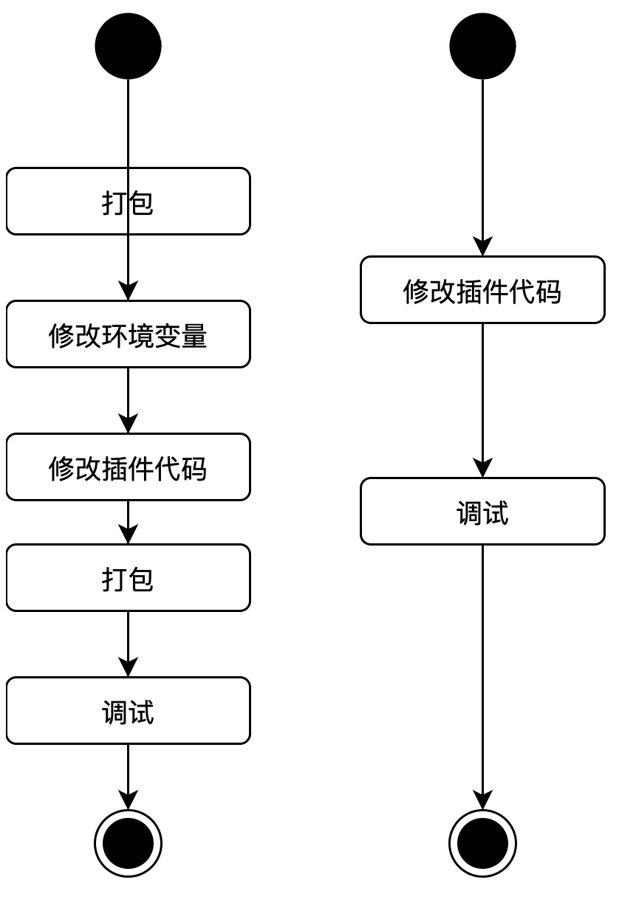
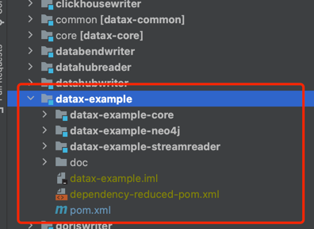
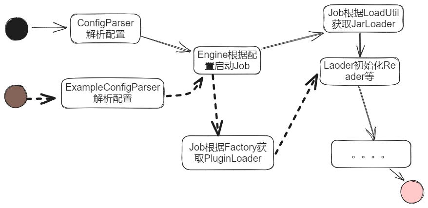

## [DataX-Example]调试datax插件的模块

### 为什么要开发这个模块

一般使用DataX启动数据同步任务是从datax.py 脚本开始，获取程序datax包目录设置到系统变量datax.home里，此后系统核心插件的加载，配置初始化均依赖于变量datax.home,这带来了一些麻烦，以一次本地 DeBug streamreader 插件为例。

- maven 打包 datax 生成 datax 目录
- 在 IDE 中 设置系统环境变量 datax.home，或者在Engine启动类中硬编码设置datax.home。
- 修改插件 streamreader 代码
- 再次 maven 打包，使JarLoader 能够加载到最新的 streamreader 代码。
- 调试代码

在以上步骤中，打包完全不必要且最耗时,等待打包也最煎熬。

所以我编写一个新的模块(datax-example)，此模块特用于本地调试和复现 BUG。如果模块顺利编写完成，那么以上流程将被简化至两步。

- 修改插件 streamreader 代码。
- 调试代码



### 目录结构
该目录结构演示了如何使用datax-example-core编写测试用例，和校验代码流程。


### 实现原理

- 不修改原有的ConfigParer,使用新的ExampleConfigParser,仅用于example模块。他不依赖datax.home,而是依赖ide编译后的target目录
- 将ide的target目录作为每个插件的目录类加载目录。



### 如何使用 
1.修改插件的pom文件，做如下改动。以streamreader为例。<br/>
改动前
```xml
<build>
		<plugins>
			<!-- compiler plugin -->
			<plugin>
				<artifactId>maven-compiler-plugin</artifactId>
				<configuration>
					<source>${jdk-version}</source>
					<target>${jdk-version}</target>
					<encoding>${project-sourceEncoding}</encoding>
				</configuration>
			</plugin>
        </plugins>
</build>
```
改动后
```xml
<build>
    <resources>
        <!--将resource目录也输出到target-->
        <resource>
            <directory>src/main/resources</directory>
            <includes>
                <include>**/*.*</include>
            </includes>
            <filtering>true</filtering>
        </resource>
    </resources>
		<plugins>
			<!-- compiler plugin -->
			<plugin>
				<artifactId>maven-compiler-plugin</artifactId>
				<configuration>
					<source>${jdk-version}</source>
					<target>${jdk-version}</target>
					<encoding>${project-sourceEncoding}</encoding>
				</configuration>
			</plugin>
        </plugins>
</build>
```
#### 在测试模块模块使用
参考datax-example/datax-example-streamreader的StreamReader2StreamWriterTest.java
```java
public class StreamReader2StreamWriterTest {
    @Test
    public void testStreamReader2StreamWriter() {
        String path = "/stream2stream.json";
        String jobPath = PathUtil.getAbsolutePathFromClassPath(path);
        ExampleContainer.start(jobPath);
    }
}

```
参考datax-example/datax-example-neo4j的StreamReader2Neo4jWriterTest
```java
public class StreamReader2Neo4jWriterTest{
@Test
    public void streamReader2Neo4j() {

        deleteHistoryIfExist();

        String path = "/streamreader2neo4j.json";
        String jobPath = PathUtil.getAbsolutePathFromClassPath(path);

        ExampleContainer.start(jobPath);

        //根据channel和reader的mock数据，校验结果集是否符合预期
        verifyWriteResult();
    }
}
```