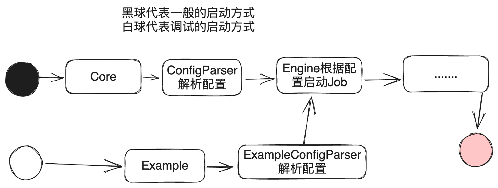

## [DataX-Example]调试datax插件的模块

### 为什么要开发这个模块

一般使用DataX启动数据同步任务是从datax.py 脚本开始，获取程序datax包目录设置到系统变量datax.home里，此后系统核心插件的加载，配置初始化均依赖于变量datax.home,这带来了一些麻烦，以一次本地 DeBug streamreader 插件为例。

- maven 打包 datax 生成 datax 目录
- 在 IDE 中 设置系统环境变量 datax.home，或者在Engine启动类中硬编码设置datax.home。
- 修改插件 streamreader 代码
- 再次 maven 打包，使JarLoader 能够加载到最新的 streamreader 代码。
- 调试代码

在以上步骤中，打包完全不必要且最耗时,等待打包也最煎熬。

所以我编写一个新的模块(datax-example)，此模块特用于本地调试和复现 BUG。如果模块顺利编写完成，那么以上流程将被简化至两步。

- 修改插件 streamreader 代码。
- 调试代码


### 实现原理

- 不修改原有的ConfigParer,使用新的ExampleConfigParser,仅用于example模块。
- 提供新的PluginLoader 插件加载器，可以从程序运行目录获取插件，与JarLoader各司其职。



### 如何使用

```java
public class Main {
    public static void main(String[] args) {
        //1. 在 datax-example pom文件中加入测试插件模块的依赖，默认导入了streamreader/writer
        //2. 在此处指定你的测试文件路径
        String path = "/job/stream2stream.json";

        Configuration configuration = ExampleConfigParser.parse(
                PathUtil.getAbsolutePathFromClassPath(path)
        );

        Engine engine = new Engine();
        engine.start(configuration);
    }
}
```
### 注意
此模块不参与打包
