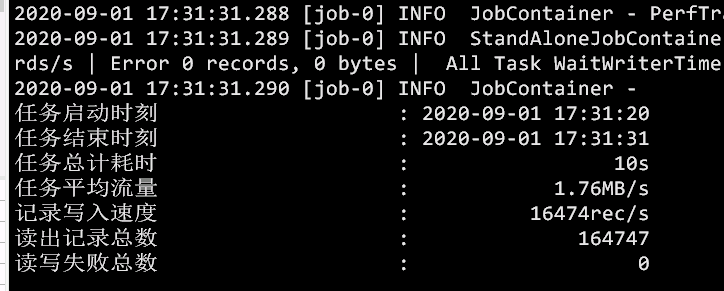

# datax-kudu-plugins
datax kudu的writer插件


eg:

```json
{
  "name": "kuduwriter",
  "parameter": {
    "kuduConfig": {
      "kudu.master_addresses": "***",
      "timeout": 60000,
      "sessionTimeout": 60000

    },
    "table": "",
    "replicaCount": 3,
    "truncate": false,
    "writeMode": "upsert",
    "partition": {
      "range": {
        "column1": [
          {
            "lower": "2020-08-25",
            "upper": "2020-08-26"
          },
          {
            "lower": "2020-08-26",
            "upper": "2020-08-27"
          },
          {
            "lower": "2020-08-27",
            "upper": "2020-08-28"
          }
        ]
      },
      "hash": {
        "column": [
          "column1"
        ],
        "number": 3
      }
    },
    "column": [
      {
        "index": 0,
        "name": "c1",
        "type": "string",
        "primaryKey": true
      },
      {
        "index": 1,
        "name": "c2",
        "type": "string",
        "compress": "DEFAULT_COMPRESSION",
        "encoding": "AUTO_ENCODING",
        "comment": "注解xxxx"
      }
    ],
    "batchSize": 1024,
    "bufferSize": 2048,
    "skipFail": false,
    "encoding": "UTF-8"
  }
}
```

必须参数：

```json
        "writer": {
          "name": "kuduwriter",
          "parameter": {
            "kuduConfig": {
              "kudu.master_addresses": "***"
            },
            "table": "***",
            "column": [
              {
                "name": "c1",
                "type": "string",
                "primaryKey": true
              },
              {
                "name": "c2",
                "type": "string",
              },
              {
                "name": "c3",
                "type": "string"
              },
              {
                "name": "c4",
                "type": "string"
              }
            ]
          }
        }
```

主键列请写到最前面




##### 配置列表

| name           | default             | description                                                  | 是否必须 |
| -------------- | ------------------- | ------------------------------------------------------------ | -------- |
| kuduConfig     |                     | kudu配置 （kudu.master_addresses等）                         | 是       |
| table          |                     | 导入目标表名                                                 | 是       |
| partition      |                     | 分区                                                         | 否       |
| column         |                     | 列                                                           | 是       |
| name           |                     | 列名                                                         | 是       |
| type           | string              | 列的类型，现支持INT, FLOAT, STRING, BIGINT, DOUBLE, BOOLEAN, LONG。 | 否       |
| index          | 升序排列            | 列索引位置(要么全部列都写，要么都不写)，如reader中取到的某一字段在第二位置（eg： name， id， age）但kudu目标表结构不同（eg：id，name， age），此时就需要将index赋值为（1，0，2），默认顺序（0，1，2） | 否       |
| primaryKey     | false               | 是否为主键（请将所有的主键列写在前面）,不表明主键将不会检查过滤脏数据 | 否       |
| compress       | DEFAULT_COMPRESSION | 压缩格式                                                     | 否       |
| encoding       | AUTO_ENCODING       | 编码                                                         | 否       |
| replicaCount   | 3                   | 保留副本个数                                                 | 否       |
| hash           |                     | hash分区                                                     | 否       |
| number         | 3                   | hash分区个数                                                 | 否       |
| range          |                     | range分区                                                    | 否       |
| lower          |                     | range分区下限 (eg: sql建表：partition value='haha' 对应：“lower”：“haha”，“upper”：“haha\000”) | 否       |
| upper          |                     | range分区上限(eg: sql建表：partition "10" <= VALUES < "20"                                                                     对应：“lower”：“10”，“upper”：“20”) | 否       |
| truncate       | false               | 是否清空表，本质上是删表重建                                 | 否       |
| writeMode      | upsert              | upsert，insert，update                                       | 否       |
| batchSize      | 512                 | 每xx行数据flush一次结果（最好不要超过1024）                  | 否       |
| bufferSize     | 3072                | 缓冲区大小                                                   | 否       |
| skipFail       | false               | 是否跳过插入不成功的数据                                     | 否       |
| timeout        | 60000               | client超时时间,如创建表，删除表操作的超时时间。单位：ms      | 否       |
| sessionTimeout | 60000               | session超时时间 单位：ms                                     | 否       |


