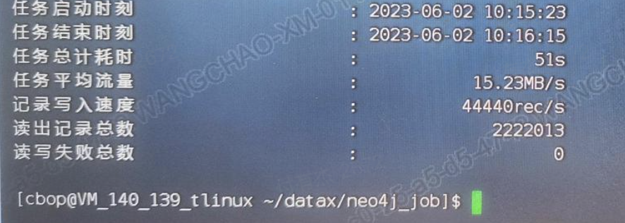

# DataX neo4jWriter 插件文档

## 功能简介

本目前市面上的neo4j 批量导入主要有Cypher Create,Load CSV,第三方或者官方提供的Batch Import。Load CSV支持节点10W级别一下，Batch Import 需要对数据库进行停机。要想实现不停机的数据写入，Cypher是最好的方式。

## 支持版本

支持Neo4j 4 和Neo4j 5,如果是Neo4j 3,需要自行将驱动降低至相对应的版本进行编译。

## 实现原理

将datax的数据转换成了neo4j驱动能识别的对象，利用 unwind 语法进行批量插入。

## 如何配置

### 配置项介绍

| 配置                               | 说明                        | 是否必须 | 默认值 | 示例                                                 |
| :--------------------------------- | --------------------------- | -------- | ------ | ---------------------------------------------------- |
| database                           | 数据库名字                  | 是       | -      | neo4j                                                |
| uri                                | 数据库访问链接              | 是       | -      | bolt://localhost:7687                                |
| username                           | 访问用户名                  | 是       | -      | neo4j                                                |
| password                           | 访问密码                    | 是       | -      | neo4j                                                |
| bearer_token                       | 权限相关                    | 否       | -      | -                                                    |
| kerberos_ticket                    | 权限相关                    | 否       | -      | -                                                    |
| cypher                             | 同步语句                    | 是       | -      | unwind $batch as row create(p) set p.name = row.name |
| batch_data_variable_name           | unwind 携带的数据变量名     |          |        | batch                                                |
| fields                             | 定义datax中数据的名字和类型 | 是       | -      | 见后续案例                                           |
| batch_size                         | 一批写入数据量              | 否       | 1000   |                                                      |
| max_transaction_retry_time_seconds | 事务运行最长时间            | 否       | 30秒   | 30                                                   |
| max_connection_timeout_seconds     | 驱动最长链接时间            | 否       | 30秒   | 30                                                   |
| retry_times                        | 发生错误的重试次数          | 否       | 3次    | 3                                                    |
| retry_sleep_mills                  | 重试失败后的等待时间        | 否       | 3秒    | 3                                                    |

### 支持的数据类型

```
BOOLEAN, 
STRING,
LONG,
SHORT,
INTEGER,
DOUBLE,
FLOAT,
LOCAL_DATE,
LOCAL_TIME,
LOCAL_DATE_TIME,
LIST,
MAP,
CHAR_ARRAY,
BYTE_ARRAY,
BOOLEAN_ARRAY,
STRING_ARRAY,
LONG_ARRAY,
INT_ARRAY,
SHORT_ARRAY,
DOUBLE_ARRAY,
FLOAT_ARRAY,
Object_ARRAY
```

### 写节点

这里提供了一个写节点包含很多类型属性的例子。你可以在我的测试方法中运行。

```json
"writer": {
        "name": "neo4jWriter",
        "parameter": {
            "uri": "neo4j://localhost:7687",
            "username": "neo4j",
            "password": "Test@12343",
            "database": "neo4j",
            "cypher": "unwind $batch as row create(p:Person) set p.pbool = row.pbool,p.pstring = row.pstring,p.plong = row.plong,p.pshort = row.pshort,p.pdouble=row.pdouble,p.pstringarr=row.pstringarr,p.plocaldate=row.plocaldate",
            "batch_data_variable_name": "batch",
            "batch_size": "33",
            "fields": [
                {
                    "fieldName": "pbool",
                    "fieldType": "BOOLEAN"
                },
                {
                    "fieldName": "pstring",
                    "fieldType": "STRING"
                },
                {
                    "fieldName": "plong",
                    "fieldType": "LONG"
                },
                {
                    "fieldName": "pshort",
                    "fieldType": "SHORT"
                },
                {
                    "fieldName": "pdouble",
                    "fieldType": "DOUBLE"
                },
                {
                    "fieldName": "pstringarr",
                    "fieldType": "STRING_ARRAY",
                    "split": ",",
                    "arrayTrimChars": [
                        "[",
                        "]"
                    ]
                },
                {
                    "fieldName": "plocaldate",
                    "fieldType": "LOCAL_DATE",
                    "dateFormat": "yyyy-MM-dd"
                }
            ]
        }
    }
```

### 写关系

```json
"writer": {
        "name": "neo4jWriter",
        "parameter": {
            "uri": "neo4j://localhost:7687",
            "username": "neo4j",
            "password": "Test@12343",
            "database": "neo4j",
            "cypher": "unwind $batch as row match(p1:Person) where p1.id = row.startNodeId match(p2:Person) where p2.id = row.endNodeId create (p1)-[:LINK]->(p2)",
            "batch_data_variable_name": "batch",
            "batch_size": "33",
            "fields": [
                {
                    "fieldName": "startNodeId",
                    "fieldType": "STRING"
                },
                {
                    "fieldName": "endNodeId",
                    "fieldType": "STRING"
                }
            ]
        }
    }
```

### 节点/关系类型动态写

> 需要使用AOPC函数拓展，如果你的数据库没有，请安装APOC函数拓展

```json
    "writer": {
        "name": "neo4jWriter",
        "parameter": {
            "uri": "bolt://localhost:7687",
            "username": "yourUserName",
            "password": "yourPassword",
            "database": "yourDataBase",
            "cypher": "unwind $batch as row CALL apoc.cypher.doIt( 'create (n:`' + row.Label + '`{id:$id})' ,{id: row.id} ) YIELD value RETURN 1 ",
            "batch_data_variable_name": "batch",
            "batch_size": "1",
            "fields": [
                {
                    "fieldName": "Label",
                    "fieldType": "STRING"
                },
                {
                    "fieldName": "id",
                    "fieldType": "STRING"
                }
            ]
        }
    }
```

## 注意事项

* fields的定义需要与源端一一对应。如果源端的数据列少于neo4j字段怎么办？建议将源端数据加工成json格式，在neo4j端将数据类型设置成map。在cypher中，可以根据jsonpath语法一直取值。比如 unwind $batch as row create (p) set p.name = row.props.name,set p.age = row.props.age
* 如果提示事务超时，建议调大事务运行时间或者调小batch_size
* 如果用于更新场景，会遇到死锁问题，建议二开源码加入死锁异常检测，并进行重试，开源版本不提供此功能。

## 性能报告

**JVM参数**

16G G1垃圾收集器 8核心

**Neo4j数据库配置**

32核心，256G

**datax 配置**

Channel 20 batchsize = 1000

