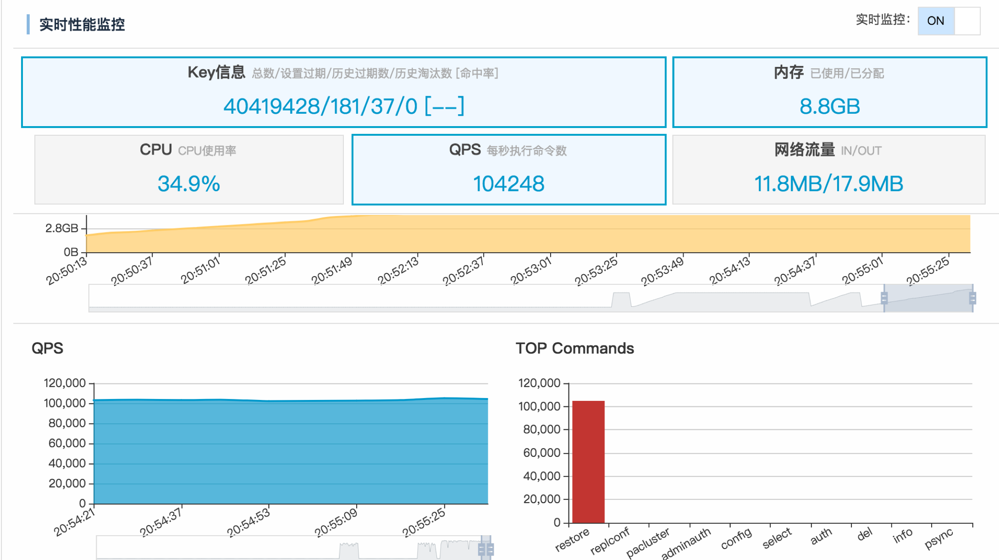

# DataX RedisWriter 说明

------------

## 1 快速介绍

RedisWrite 提供了还原Redis dump命令的能力，并写入到目标Redis。支持redis cluster集群、proxy、以及单机


## 2 功能与限制

1. 支持写入redis cluster集群、proxy、以及单机。


我们暂时不能做到：

1. 只支持写入Redis数据源。


## 3 功能说明


### 3.1 配置样例

```json
{
    "job": {
        "content": [
            {
                "reader": {
                    "name": "redisreader",
                    "parameter": {
                        "connection": [
                            {
                                "uri": "file:///root/dump.rdb",
                                "uri": "http://localhost/dump.rdb",
                                "uri": "tcp://127.0.0.1:7001",
                                "uri": "tcp://127.0.0.1:7002",
                                "uri": "tcp://127.0.0.1:7003",
                            }
                        ]
                    }
                },
                "writer": {
                    "name": "rediswriter",
                    "parameter": {
                        "connection": [
                            {
                                "uri": "tcp://127.0.0.1:6379",
                                "auth": "123456"
                            }
                        ],
                        "redisCluster":false,
                        "flushDB":false
                    }
                }
            }
        ],
        "setting": {
            "speed": {
                "channel": 1
            }
        }
    },
    "core": {
        "transport": {
            "channel": {
                "byteCapacity": 524288000
            }
        }
    }
}
```

### 3.2 参数说明


* **rediswriter.parameter.connection**

	* 描述：redis连接 支持单机/proxy/redis cluster写入,单机/proxy/redis cluster集群只需填写一个地址即可,程序会自动获取集群里的所有master <br />

	* 必选：是 <br />

	* 默认值：, <br />

* **rediswriter.parameter.redisCluster**

	* 描述：redis cluster集群请务必填写此项，否者无法定位slot槽。如果是proxy或单机忽略该项 <br />

	* 必选：否 <br />

	* 默认值：false <br />

* **rediswriter.parameter.flushDB**

	* 描述：迁移前格式化目标Redis <br />

	* 必选：否 <br />

	* 默认值：false <br />

* **rediswriter.parameter.batchSize**

	* 描述：每次批量处理数量。如果key过大/小,可以相应的调整.<br />

 	* 必选：否 <br />

 	* 默认值：1000<br />

* **rediswriter.parameter.timeout**

	* 描述：每次执行最大超时时间。<br />

 	* 必选：否 <br />

 	* 默认值：60000毫秒<br />


* **byteCapacity**

	* 描述：单个key过大可以做相应的调整默认64Mb。<br />

 	* 必选：否 <br />

 	* 默认值： <br />

* **channel**

	* 描述：并发执行线程 请填写1,多个线程并没有显著的性能提升.建议调整batchSize提升性能<br />

 	* 必选：否 <br />

 	* 默认值：1 <br />


## 4 性能报告

测试数据 13G 共6千万个key,每次批量写入1000个key


测试机器配置 自建 Redis Cluster 集群 一台4核 16G 3个实例 测试机与集群不属于同一个机器

```
任务启动时刻                    : 2018-09-03 02:25:00
任务结束时刻                    : 2018-09-03 02:30:30
任务总计耗时                    :                330s
任务平均流量                    :           19.19MB/s
记录写入速度                    :         181632rec/s
读出记录总数                    :            59938871
读写失败总数                    :                   0

```


测试机器配置 阿里云 redis 16G 集群版,最大带宽384mb


```
任务启动时刻                    : 2018-09-02 20:48:46
任务结束时刻                    : 2018-09-02 20:58:57
任务总计耗时                    :                610s
任务平均流量                    :           10.38MB/s
记录写入速度                    :          98262rec/s
读出记录总数                    :            59938871
读写失败总数                    :                   0
```



## 5 约束限制

1. 暂无


## 6 FAQ


