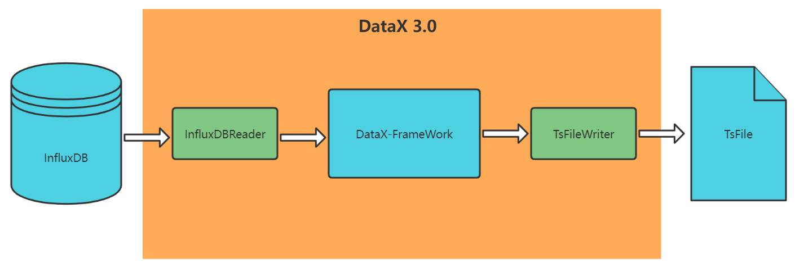
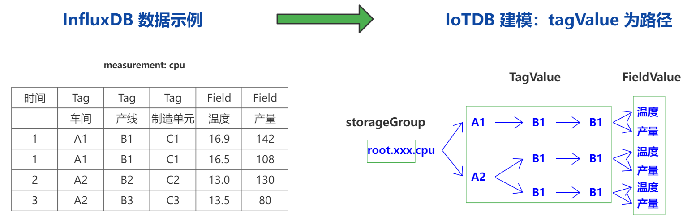

# 1. 概览
##   1.1. 简介
   本迁移工具是基于 DataX 框架的由 InfluxDB 直接写入 TsFile 的数据迁移工具。
本迁移工具最大的特点：
* 根据 InfluxDB 与 IoTDB 的 Schema 特点，定制两者的映射规则。
* 用户无需指定具体的 Schema 信息，迁移工具根据用户自定义的时间范围，进行自动解析与映射。
* 直接写入 TsFile，无需调用 IoTDB 的 Session API，节省了网络通信、IoTDB Server 的元数据校验、写入 WAL、避免了 DataRegion 级别的写锁的获取与释放等开销。
通过配置合理的 InfluxDBReader 插件的切分策略，能将作业合理切分成多个 Task 并行执行，单机多线程执行模型可以让 DataX 速度随并发成线性增长。在源端和目的端性能都足够的情况下，单个作业（Job）一定可以打满网卡。
直接写入 TsFile 可以充分利用磁盘的  I/O 性能，大大提高写入速度。
## 1.2. 架构

迁移工具基于 DataX，开发了 InfluxDBReader 与 TsFileWriter 插件。
## 1.3. 映射规则

1. 用户可根据数据源特点提前建模，在 Job 配置文件中自定义 StrorageGroup。
2. 在 InfluxDB 中 Measurement 是在 bucket（可理解为库） 中作为一种分组，在写入数据时指定好会自动创建。所以将 InlufxDB 中的 Measurement 概念映射到 IoTDB中。
3. 将 TagValue 按照 TagKey 的固定顺序，拼接在 Timeseries 的路径上。
4. InfluxDB 的 FielKey 对应 IoTDB 的 measurement（物理量），将 fieldValue 拼接在路径的最后面。
现在规定 DataX 中的 DefaultRecord：
```
[_time值, _value值, _field值, _measurement值, Tag1Key, Tag1Value, Tag2Key, Tag2Value, ... ,TagNKey, TagNValue]
```
转成 IoTDB SQL 如下
```
insert into sg._measurement值.Tag1Value.Tag2Value. ... .TagNValue(timestamp,_field值) values(_time值,_value值)
```
## 1.4. 版本说明
当前支持的版本：
InfluxDB 版本: V2.4.0
TsFile 依赖 Jar 包版本 : 0.13.1
DataX 版本：V3.0
# 2. 使用指南
## 2.1. 使用条件
   数据源必须严格有序（按时间戳从小到大单调递增），否则 TsFIle 会产生乱序数据。
## 2.2. 定义 Job 文件
创建 influxdb2tsfile.json，可定义如下信息：
```
{
  "job": {
    "content": [
      {
        "reader": {
          "name": "influxdbreader",
          "parameter": {
            "connection": [
              {
                "url": "http://172.20.48.111:8086",
                "token": "ty1lVsJUYYfSO-Da0IMXWig2Tpuhzr-uqv7PEFwB71WcPo5NVLFyK3AYAG8QbTskUN62-37rU7-C9Pw9JNAKEA==",
                "org": "tsdb",
                "bucket": "shen"
              }
            ],
            "column": [],
            "beginDateTime": "2022-09-25 00:00:00",
            "endDateTime": "2022-09-29 00:00:00",
            "splitIntervalHour": 2,
            "miniTaskIntervalSecond": 3600,
            "measurements":[]
          }
        },
        "writer": {
          "name": "iotdbtsfilewriter",
          "parameter": {
            "storeGroup": "root.influxdb",
            "outputDir": "data",
            "vsgNum": 1,
            "tsfileThresholdM": 1000
          }
        }
      }
    ],
    "setting": {
      "speed": {
        "channel": "9"
      }
    }
  }
}
```
## 2.3. Job 文件参数说明与设置建议
reader 部分：
* connection：连接 influxdb 的必要参数。
* column：预留，用于用户自定义 Schema，目前暂不支持。
* beginDateTime：整个 Job 的迁移数据的开始时间，格式需要设置为 "yyyy-MM-dd HH:mm:ss"。
* endDateTime：整个 Job 的迁移数据的结束时间，格式需要设置为 "yyyy-MM-dd HH:mm:ss"。
* splitIntervalHour：每个 Task 的时间窗口（单位：小时），Job 可切分为 N 个 Task。每个 Task 会写入 N 个 TsFile（N 取决于可写入的虚拟存储组数量）。建议根据业务特点进行测试并进行设置。
* miniTaskIntervalSecond：InfluxReader 插件调用 queryApi 依据时间范围进行查询，单词查询数据量较大的情况下（如 50w 条 Record）会出现数据丢失问题，miniTaskIntervalSecond 将 Task 进一步切分（单位：秒）。
* measurement：预留，用于用户自定义迁移指定的 measurement
writer 部分：
* storageGroup：用户可根据数据源特点提前建模自定义 StrorageGroup。
* outputDir：自定义 TsFile 的输出路径。
* vsgNum：虚拟存储组数量。
* tsfileSizeThresholdMB：每个 TsFile 文件容量的最大值，单位为 MB。
setting 部分：
* channel：并发数量，I/O 密集型，建设设置为 CPU 核数 + 1。最终的 channel 数量与 TaskGroup 的并发数量（默认为5）和 Task 的切分数量（Task 数量要足够）有关。 
  最终的并发数 = taskGroup 数量 * 每个 TaskGroup 并发执行的 Task 数。
* byte：默认为 -1，byte = 100, 则 100 byte/s。
* record：默认为 -1，record = 100，则 100/s。
byte 和 record 都可以设置，那么取最小值。如果这俩都没有设置，那么会读取 channel，channel 的优先级最低。
## 2.4. 时间戳标准与时区说明
迁移工具的 InfluxDBReader 使用的是 influxdb-client-java，底层使用的时间戳标准为 RFC 3339，RFC允许我们用“空格”替换“ T”。
在对 Job 文件进行配置时，需要注意时区的影响（系统的默认时区与数据源时间戳时区是否一致）。
比如，数据源是 0 时区，而我们读取配置文件是默认转化为东8区的时间（系统默认时区），这个时候可以修改系统默认时区与数据源的时区一致，或者将配置文件中的 beginTime 与 endTime 减去 8 H。
## 2.5. 堆内存与 Channel 设置建议
利用 Influxdb 的自监控数据，经过测试，约 1.2 w 条 record 的 FluxRecord 中的 LinkedHashMap 大约占 1MB 堆内存，InfluxDB 的查询结果 FluxRecord 大约占整个 DataX 进程所需堆内存的 40%，也就是说需要 2.5MB，即每 1 w 条 record 需要 2 MB 堆内存，大约每 1000w 条 record 需要 2GB 堆内存。
假设需要迁移的数据为 8000w 条，每个 Influx 查询窗口会查询 1000w 条数据， 若用户设置 4 个 channel，那么将有 4 个线程同时开启数据迁移工作，这时堆内存至少需要 8GB，那么建议设置 10 GB 堆内存，才不会出现 OOM。
用户需要根据采集点的数量，数据采集频率，计算设置的 miniTaskIntervalSecond 时间窗口内查询的记录数量，并结合设置的 channel 数量，推算出迁移工具需要的堆内存大小。
## 2.6. 编译与启动
mvn 命令：
```
mvn clean -U package assembly:assembly -DskipTests
```
在 target/datax/datax 路径下，使用启动 python 脚本并指定 Job 文件：
```
bin/datax.py job/influxdb2tsfile
```
## 2.7. 将 TsFile load 到 IoTDB
将数据写入 TsFile 后，即可按文件夹将相应 TsFile 导入到 IoTDB 中。需要将 IoTDB 配置文件 iotdb-engine.properties 中的 virtual_storage_group_num 与 DataX Job 文件中的 vsgNum 的数量保持一致。
```
Eg: IoTDB > load '/Users/Desktop/data/1575028885956-101-0.tsfile'
```
## 2.8. 数据校验
现在已经提供迁移后的数据校验工具，主要通过：1. InfluxDB 迁移时间范围内的记录总数与迁移到 IoTDB 的所有记录总数进行对比；2. 进行抽样检测，对比采集的具体数据是否一致。
用户迁移之后，可使用数据校验工具进行检测。